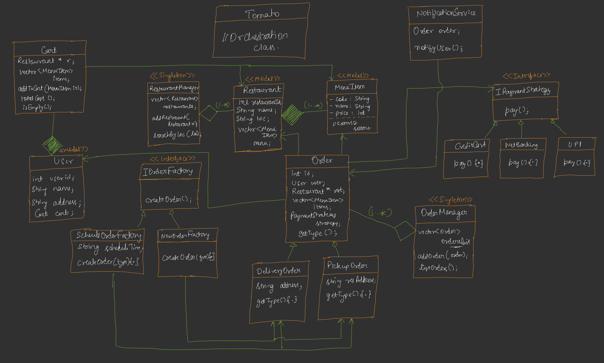

# Food Delivery App

### Functional Requirements
- User can search for restaurants based on location
- user can add item to cart
- user can place order by making payment
- user should notify the once order is placed

### Non Functional Requirements
- System should scalable or not
- multithreading or not
